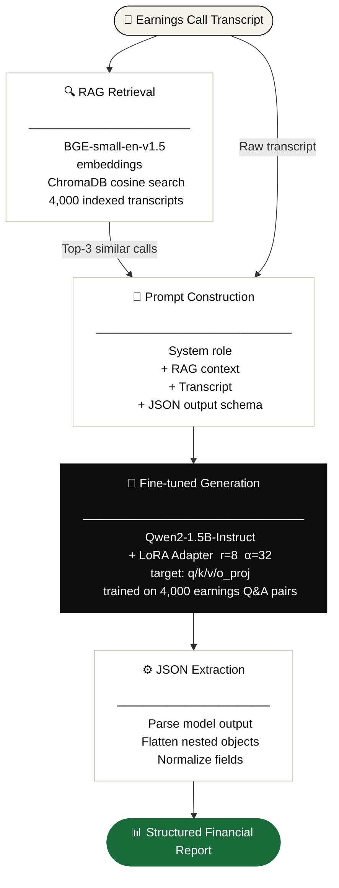

# EarningsScribe

**Fine-tuned LLM + RAG pipeline for structured earnings call analysis**

🔗 [**Live Demo**](https://jiviteshhp-earningsscribe.hf.space/ui) &nbsp;|&nbsp; 🤗 [**LoRA Adapter**](https://huggingface.co/jiviteshhp/earningsscribe-adapter) &nbsp;|&nbsp; 📓 [**Training Notebook**](notebooks/EarningsScribe_Training.ipynb)

> Fine-tuned Qwen2-1.5B on earnings call transcripts using LoRA. Improved ROUGE-L from 0.09 → 0.21 **(+128%)** and BERTScore F1 from 0.68 → 0.85 **(+25%)** over the base model on a held-out test set of 50 samples.

---

## Live Demo

**[https://jiviteshhp-earningsscribe.hf.space/ui](https://jiviteshhp-earningsscribe.hf.space/ui)**

Paste any earnings call transcript and get a structured report with key metrics, guidance, risks, and sentiment — grounded by semantically similar historical calls retrieved via RAG.

---

## What It Does

EarningsScribe takes a raw earnings call transcript and produces a structured financial report:

- **Executive Summary** — 2-3 sentence performance overview with specific numbers
- **Key Metrics** — Revenue, margins, growth rates extracted as clean tiles
- **Management Guidance** — Forward-looking statements for next quarter
- **Risk Factors** — Identified headwinds and challenges
- **Sentiment** — Positive / Neutral / Negative classification
- **RAG Context** — Top-3 similar historical calls retrieved to ground the analysis

---

## Architecture



---

## Fine-Tuning Results

Evaluated on 50 held-out samples from `lamini/earnings-calls-qa`:

| Metric       | Base Model | Fine-tuned | Improvement |
|--------------|:----------:|:----------:|:-----------:|
| ROUGE-1      | 0.1333     | 0.2494     | **+87.1%**  |
| ROUGE-2      | 0.0244     | 0.0895     | **+266.8%** |
| ROUGE-L      | 0.0922     | 0.2100     | **+127.8%** |
| BERTScore F1 | 0.6798     | 0.8476     | **+24.7%**  |

**Key decisions that drove improvement:**
- LoRA rank r=8 with alpha=32 — higher alpha/rank ratio encourages stronger adaptation without overfitting on a 4K dataset
- Target modules: q_proj, k_proj, v_proj, o_proj — full attention head adaptation for better sequence understanding
- Exact training prompt format preserved at inference — critical for instruction-tuned models
- Domain-specific data: all 4,000 samples are earnings call Q&A pairs, not general financial text

---

## Training

**Base model:** `Qwen/Qwen2-1.5B-Instruct`  
**Dataset:** `lamini/earnings-calls-qa` — 4,000 train / 500 val / 500 test  
**Hardware:** Google Colab T4 GPU  
**Training time:** ~45 minutes  

**LoRA config:**
```python
LoraConfig(
    r=8,
    lora_alpha=32,
    lora_dropout=0.05,
    target_modules=["q_proj", "k_proj", "v_proj", "o_proj"],
    task_type="CAUSAL_LM"
)
```

**Training args:**
```python
TrainingArguments(
    num_train_epochs=3,
    per_device_train_batch_size=4,
    gradient_accumulation_steps=4,
    learning_rate=2e-4,
    lr_scheduler_type="cosine",
    warmup_ratio=0.05,
    fp16=True,
)
```

See [`notebooks/EarningsScribe_Training.ipynb`](notebooks/EarningsScribe_Training.ipynb) for the full training and evaluation pipeline.

---

## RAG Pipeline

- **Vector DB:** ChromaDB 0.4.24 with persistent storage
- **Embedding model:** `BAAI/bge-small-en-v1.5` (cosine similarity)
- **Index:** 4,000 earnings call transcripts from training set
- **Retrieval:** top-3 semantically similar calls injected as context
- **Why RAG?** Grounds generation in real financial language patterns, reduces hallucination of specific numbers

---

## Project Structure

```
EarningsScribe/
├── notebooks/
│   └── EarningsScribe_Training.ipynb   # full training + eval pipeline
├── src/
│   ├── download_data.py                # dataset download + processing
│   ├── rag.py                          # ChromaDB + BGE pipeline
│   └── generate.py                     # local generation pipeline
├── hf_space/                           # HuggingFace Space deployment
│   ├── main.py                         # FastAPI backend
│   ├── rag.py                          # Space-specific RAG (Docker paths)
│   ├── index.html                      # Frontend UI
│   ├── Dockerfile
│   └── requirements.txt
└── data/
    └── processed/
        ├── train.json                  # 4,000 samples
        ├── validation.json             # 500 samples
        └── test.json                   # 500 samples (held-out)
```

---

## Local Setup

```bash
git clone https://github.com/jiviteshhp/EarningsScribe
cd EarningsScribe
pip install -r hf_space/requirements.txt
export HF_TOKEN=your_token_here
python src/rag.py          # build the RAG index
cd hf_space
uvicorn main:app --host 0.0.0.0 --port 8000
```

Open `http://localhost:8000/ui`

---

## Deployment

Deployed on **HuggingFace Spaces** (Docker runtime):

- Pre-built ChromaDB index stored in a separate HF Dataset repo, downloaded at startup in ~10 seconds
- LoRA adapter stored at `jiviteshhp/earningsscribe-adapter`
- FastAPI backend serves both the API and the frontend from a single container
- Health check: `GET /health` returns model status and RAG document count

---

## Tech Stack

| Component | Technology |
|-----------|------------|
| Base LLM | Qwen2-1.5B-Instruct |
| Fine-tuning | LoRA via PEFT 0.18.1 |
| Vector DB | ChromaDB 0.4.24 |
| Embeddings | BAAI/bge-small-en-v1.5 |
| Backend | FastAPI + Uvicorn |
| Frontend | Vanilla HTML/CSS/JS |
| Deployment | HuggingFace Spaces (Docker) |
| Training | Google Colab T4 |

---

## Author

**Jivitesh** — [GitHub](https://github.com/jiviteshhp) · [HuggingFace](https://huggingface.co/jiviteshhp)
